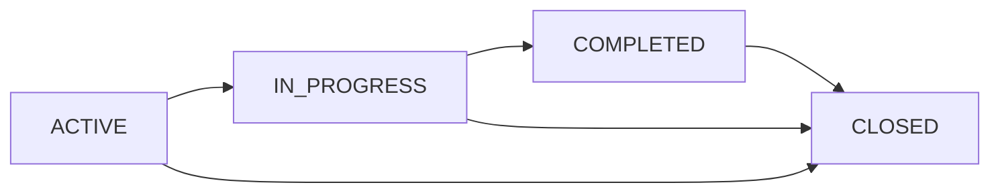

# 📋 Módulo de Casos - Documentación Técnica

## 📋 Descripción General

El módulo de casos es el **componente clínico principal** del sistema OOTS Colombia. Gestiona expedientes médicos completos asociados a participantes, incluyendo evaluaciones, planes de intervención, seguimiento del progreso y cierre de casos. Cada caso representa un proceso terapéutico integral con documentación clínica detallada.

## 🏗️ Arquitectura

```
cases/
├── cases.controller.ts           # Controlador con endpoints CRUD
├── cases.service.ts             # Lógica de negocio clínica
├── cases.module.ts              # Configuración del módulo
├── dto/
│   └── case.dto.ts              # DTOs de validación para casos
└── entities/
    ├── case.entity.ts           # Entidad principal del caso
    ├── physical-health-history.entity.ts
    ├── mental-health-history.entity.ts
    ├── intervention-plan.entity.ts
    ├── progress-note.entity.ts
    ├── ponderacion.entity.ts
    └── closing-note.entity.ts
```

## 📊 Modelo de Datos

### Entidad Principal: Case

```typescript
@Entity('cases')
export class Case {
  @PrimaryGeneratedColumn()
  id: number;

  @Column({ length: 20, unique: true })
  caseNumber: string; // Generado automáticamente: CASE-0001, CASE-0002...

  @Column({
    type: 'enum',
    enum: CaseStatus,
    default: CaseStatus.ACTIVE,
  })
  status: CaseStatus;

  // Participante asociado
  @ManyToOne(() => Participant, (participant) => participant.cases)
  @JoinColumn({ name: 'participant_id' })
  participant: Participant;

  @Column({ name: 'participant_id' })
  participantId: number;

  // Información clínica simplificada (campos de texto)
  @Column({ type: 'text', nullable: true })
  consultationReason?: string; // Motivo de consulta detallado

  @Column({ type: 'json', nullable: true })
  identifiedSituations?: number[]; // Array de IDs de situaciones

  @Column({ type: 'text', nullable: true })
  intervention?: string; // Intervención inicial

  @Column({ type: 'json', nullable: true })
  followUpPlan?: number[]; // Array de IDs de planes

  @Column({ type: 'text', nullable: true })
  referrals?: string; // Referencias a otros profesionales

  // Relaciones con entidades médicas detalladas
  @OneToOne(() => PhysicalHealthHistory, (history) => history.case, {
    cascade: true,
  })
  physicalHealthHistory?: PhysicalHealthHistory;

  @OneToOne(() => MentalHealthHistory, (history) => history.case, {
    cascade: true,
  })
  mentalHealthHistory?: MentalHealthHistory;

  @OneToOne(() => Ponderacion, (ponderacion) => ponderacion.case, {
    cascade: true,
  })
  ponderacion?: Ponderacion;

  @OneToMany(() => InterventionPlan, (plan) => plan.case, { cascade: true })
  interventionPlans?: InterventionPlan[];

  @OneToMany(() => ProgressNote, (note) => note.case, { cascade: true })
  progressNotes?: ProgressNote[];

  @OneToOne(() => ClosingNote, (note) => note.case, { cascade: true })
  closingNote?: ClosingNote;

  // Timestamps
  @CreateDateColumn()
  createdAt: Date;

  @UpdateDateColumn()
  updatedAt: Date;
}
```

### Estados del Caso (CaseStatus Enum)

```typescript
export enum CaseStatus {
  ACTIVE = 'ACTIVE', // Caso activo, recién creado
  IN_PROGRESS = 'IN_PROGRESS', // En proceso de intervención
  COMPLETED = 'COMPLETED', // Intervención completada exitosamente
  CLOSED = 'CLOSED', // Caso cerrado (cualquier motivo)
}
```

### Entidades Médicas Relacionadas

#### PhysicalHealthHistory (Historia de Salud Física)

```typescript
@Entity('physical_health_histories')
export class PhysicalHealthHistory {
  @PrimaryGeneratedColumn()
  id: number;

  @Column({ type: 'text', nullable: true })
  currentConditions?: string; // Condiciones médicas actuales

  @Column({ type: 'text', nullable: true })
  medications?: string; // Medicamentos actuales

  @Column({ type: 'text', nullable: true })
  familyHistoryFather?: string; // Antecedentes paternos

  @Column({ type: 'text', nullable: true })
  familyHistoryMother?: string; // Antecedentes maternos

  @Column({ type: 'text', nullable: true })
  observations?: string; // Observaciones médicas

  @OneToOne(() => Case, (caseEntity) => caseEntity.physicalHealthHistory)
  @JoinColumn({ name: 'case_id' })
  case: Case;

  @Column({ name: 'case_id' })
  caseId: number;

  @CreateDateColumn()
  createdAt: Date;

  @UpdateDateColumn()
  updatedAt: Date;
}
```

#### MentalHealthHistory (Historia de Salud Mental)

```typescript
@Entity('mental_health_histories')
export class MentalHealthHistory {
  @PrimaryGeneratedColumn()
  id: number;

  @Column({ type: 'text', nullable: true })
  currentConditions?: string; // Condiciones mentales actuales

  @Column({ type: 'text', nullable: true })
  medications?: string; // Medicamentos psiquiátricos

  @Column({ type: 'text', nullable: true })
  familyHistoryFather?: string; // Antecedentes paternos

  @Column({ type: 'text', nullable: true })
  familyHistoryMother?: string; // Antecedentes maternos

  @Column({ type: 'text', nullable: true })
  observations?: string; // Observaciones psicológicas

  @OneToOne(() => Case, (caseEntity) => caseEntity.mentalHealthHistory)
  @JoinColumn({ name: 'case_id' })
  case: Case;

  @Column({ name: 'case_id' })
  caseId: number;

  @CreateDateColumn()
  createdAt: Date;

  @UpdateDateColumn()
  updatedAt: Date;
}
```

#### Ponderacion (Análisis Profesional)

```typescript
@Entity('ponderaciones')
export class Ponderacion {
  @PrimaryGeneratedColumn()
  id: number;

  @Column({ type: 'text', nullable: true })
  consultationMotiveAnalysis?: string; // Análisis del motivo

  @Column({ type: 'text', nullable: true })
  identifiedSituationAnalysis?: string; // Análisis de situaciones

  @Column({ type: 'text', nullable: true })
  favorableConditions?: string; // Condiciones favorables

  @Column({ type: 'text', nullable: true })
  unfavorableConditions?: string; // Condiciones desfavorables

  @Column({ type: 'text', nullable: true })
  theoreticalApproach?: string; // Enfoque teórico a aplicar

  @OneToOne(() => Case, (caseEntity) => caseEntity.ponderacion)
  @JoinColumn({ name: 'case_id' })
  case: Case;

  @Column({ name: 'case_id' })
  caseId: number;

  @CreateDateColumn()
  createdAt: Date;

  @UpdateDateColumn()
  updatedAt: Date;
}
```

#### InterventionPlan (Plan de Intervención)

```typescript
@Entity('intervention_plans')
export class InterventionPlan {
  @PrimaryGeneratedColumn()
  id: number;

  @Column({ type: 'text', nullable: true })
  goal?: string; // Meta del plan

  @Column({ type: 'text', nullable: true })
  objectives?: string; // Objetivos específicos

  @Column({ type: 'text', nullable: true })
  activities?: string; // Actividades a realizar

  @Column({ type: 'text', nullable: true })
  timeline?: string; // Cronograma (campo TEXT para flexibilidad)

  @Column({ type: 'text', nullable: true })
  responsible?: string; // Responsable (campo TEXT para flexibilidad)

  @Column({ type: 'text', nullable: true })
  evaluationCriteria?: string; // Criterios de evaluación

  @ManyToOne(() => Case, (caseEntity) => caseEntity.interventionPlans)
  @JoinColumn({ name: 'case_id' })
  case: Case;

  @Column({ name: 'case_id' })
  caseId: number;

  @CreateDateColumn()
  createdAt: Date;

  @UpdateDateColumn()
  updatedAt: Date;
}
```

#### ProgressNote (Nota de Progreso)

```typescript
@Entity('progress_notes')
export class ProgressNote {
  @PrimaryGeneratedColumn()
  id: number;

  @Column({ type: 'date' })
  sessionDate: Date; // Fecha de la sesión

  @Column({ length: 50, nullable: true })
  sessionType?: string; // Tipo: INDIVIDUAL, GRUPAL, FAMILIAR, etc.

  @Column({ type: 'text', nullable: true })
  summary?: string; // Resumen de la sesión

  @Column({ type: 'text', nullable: true })
  observations?: string; // Observaciones clínicas

  @Column({ type: 'text', nullable: true })
  agreements?: string; // Acuerdos establecidos

  @ManyToOne(() => Case, (caseEntity) => caseEntity.progressNotes)
  @JoinColumn({ name: 'case_id' })
  case: Case;

  @Column({ name: 'case_id' })
  caseId: number;

  @CreateDateColumn()
  createdAt: Date;

  @UpdateDateColumn()
  updatedAt: Date;
}
```

#### ClosingNote (Nota de Cierre)

```typescript
@Entity('closing_notes')
export class ClosingNote {
  @PrimaryGeneratedColumn()
  id: number;

  @Column({ type: 'date', nullable: true })
  closingDate?: Date; // Fecha de cierre

  @Column({ length: 100, nullable: true })
  reason?: string; // Motivo: TREATMENT_COMPLETED, PARTICIPANT_WITHDRAWAL, etc.

  @Column({ type: 'text', nullable: true })
  achievements?: string; // Logros alcanzados

  @Column({ type: 'text', nullable: true })
  recommendations?: string; // Recomendaciones finales

  @Column({ type: 'text', nullable: true })
  observations?: string; // Observaciones de cierre

  @OneToOne(() => Case, (caseEntity) => caseEntity.closingNote)
  @JoinColumn({ name: 'case_id' })
  case: Case;

  @Column({ name: 'case_id' })
  caseId: number;

  @CreateDateColumn()
  createdAt: Date;

  @UpdateDateColumn()
  updatedAt: Date;
}
```

## 🎯 Funcionalidades del Módulo

### 1. Creación de Casos

Cada caso se asocia a un participante específico y puede incluir:

#### Información Básica Requerida

- **participantId**: ID del participante
- **Número de caso**: Generado automáticamente (CASE-0001, CASE-0002...)
- **Estado inicial**: ACTIVE por defecto

#### Información Clínica Opcional

- **Motivo de consulta**: Descripción detallada
- **Situaciones identificadas**: Array de IDs del catálogo
- **Intervención inicial**: Descripción de la primera intervención
- **Plan de seguimiento**: Array de IDs del catálogo
- **Referencias**: Derivaciones a otros profesionales

#### Información Médica Detallada

- **Historia física**: Condiciones, medicamentos, antecedentes
- **Historia mental**: Condiciones psicológicas, tratamientos
- **Ponderación**: Análisis profesional integral
- **Planes de intervención**: Objetivos, actividades, cronograma
- **Notas de progreso**: Seguimiento sesión por sesión
- **Nota de cierre**: Resumen final y logros

### 2. Gestión de Estados

#### Transiciones de Estado Permitidas



#### Reglas de Transición

- **ACTIVE → IN_PROGRESS**: Cuando inicia la intervención activa
- **IN_PROGRESS → COMPLETED**: Cuando se logran los objetivos
- **IN_PROGRESS → CLOSED**: Por cualquier motivo (abandono, derivación, etc.)
- **ACTIVE → CLOSED**: Si el caso se cierra sin intervención
- **COMPLETED → CLOSED**: Proceso administrativo final

### 3. Seguimiento y Documentación

#### Notas de Progreso

- Registro cronológico de cada sesión
- Tipo de sesión (individual, grupal, familiar)
- Resumen de actividades realizadas
- Observaciones clínicas relevantes
- Acuerdos y tareas asignadas

#### Planes de Intervención

- Objetivos terapéuticos específicos
- Actividades programadas
- Cronograma de ejecución
- Responsable de la intervención
- Criterios de evaluación del progreso

## 🛠️ API Endpoints

### POST /api/v1/cases

**Crear nuevo caso para un participante**

**Request Body (Ejemplo Completo):**

```json
{
  "participantId": 1,
  "consultationReason": "El participante presenta síntomas de ansiedad y estrés post-separación matrimonial que están afectando su funcionamiento laboral y social.",
  "identifiedSituations": [1, 3, 5, 8],
  "intervention": "Se evidencia sintomatología ansiosa moderada con afectación del sueño y concentración. Se realizó evaluación inicial integral.",
  "followUpPlan": [1, 2, 3],
  "physicalHealthHistory": {
    "currentConditions": "Hipertensión arterial controlada diagnosticada hace 3 años, migrañas tensionales frecuentes los fines de semana",
    "medications": "Losartán 50mg una vez al día en ayunas para control de hipertensión arterial",
    "familyHistoryFather": "Padre fallecido a los 65 años por infarto agudo de miocardio, antecedentes de diabetes tipo 2",
    "familyHistoryMother": "Madre viva de 68 años con hipertensión arterial y artritis reumatoide en manos",
    "observations": "Se recomienda continuar con controles médicos regulares cada 3 meses y evaluación cardiológica anual"
  },
  "mentalHealthHistory": {
    "currentConditions": "Episodios de ansiedad generalizada desde hace 2 años, intensificados en los últimos 6 meses",
    "medications": "No recibe tratamiento farmacológico actual para salud mental",
    "familyHistoryFather": "Padre tenía tendencia al aislamiento social en sus últimos años",
    "familyHistoryMother": "Madre con episodios de depresión postparto después del segundo hijo",
    "observations": "Se sugiere evaluación psicológica especializada y posible referencia a psiquiatría según evolución"
  },
  "ponderacion": {
    "consultationMotiveAnalysis": "Estrés laboral crónico con impacto significativo en funcionamiento familiar y personal, manifestado como síntomas ansiosos",
    "identifiedSituationAnalysis": "Situación de crisis vital relacionada con cambios importantes en la estructura familiar y presión laboral aumentada",
    "favorableConditions": "Insight adecuado sobre su situación, motivación al cambio, red de apoyo familiar presente, estabilidad económica",
    "unfavorableConditions": "Falta de tiempo para autocuidado, resistencia inicial a técnicas de relajación, perfeccionismo como rasgo de personalidad",
    "theoreticalApproach": "Terapia cognitivo-conductual con elementos de mindfulness para manejo del estrés y técnicas de reestructuración cognitiva"
  },
  "interventionPlans": [
    {
      "goal": "Reducir los niveles de estrés y ansiedad al 70% en un periodo de 8 semanas mediante técnicas terapéuticas específicas",
      "objectives": "Aprender y aplicar técnicas de relajación progresiva, identificar y modificar pensamientos automáticos negativos, establecer rutinas de autocuidado",
      "activities": "Sesiones semanales de orientación psicológica individual (8 sesiones), práctica diaria de técnicas de respiración, registro de pensamientos y emociones",
      "timeline": "8 semanas intensivas de intervención + 4 sesiones de seguimiento mensual para consolidación de cambios",
      "responsible": "Psicóloga orientadora María Elena Vargas, Lic. en Psicología clínica con especialización en terapia cognitivo-conductual",
      "evaluationCriteria": "Disminución de puntuación en escala de ansiedad GAD-7 de 15 puntos a menos de 8 puntos, mejora en calidad del sueño medida por índice de Pittsburgh"
    },
    {
      "goal": "Fortalecer estrategias de afrontamiento para situaciones estresantes del ámbito laboral y familiar",
      "objectives": "Desarrollar habilidades de comunicación asertiva, establecer límites saludables en el trabajo, mejorar manejo del tiempo",
      "activities": "Role-playing de situaciones conflictivas, técnicas de asertividad, planificación de horarios y prioridades",
      "timeline": "Semanas 4-8 del proceso terapéutico principal",
      "responsible": "Psicóloga orientadora María Elena Vargas",
      "evaluationCriteria": "Autoreporte de mejora en relaciones interpersonales, disminución de horas extras laborales, establecimiento de rutinas de descanso"
    }
  ],
  "progressNotes": [
    {
      "sessionDate": "2024-01-15",
      "sessionType": "INDIVIDUAL",
      "summary": "Primera sesión de orientación psicológica. Se estableció rapport adecuado con la participante. Se realizó evaluación inicial mediante entrevista semiestructurada y aplicación de escalas.",
      "observations": "María presenta insight adecuado sobre su situación, muestra disposición al cambio y comprende la relación entre eventos estresores y sintomatología presentada",
      "agreements": "Practicar técnicas de respiración diafragmática 2 veces al día (mañana y noche), llevar registro diario de nivel de ansiedad del 1 al 10, leer material psicoeducativo sobre ansiedad"
    },
    {
      "sessionDate": "2024-01-22",
      "sessionType": "INDIVIDUAL",
      "summary": "Segunda sesión enfocada en psicoeducación sobre ansiedad y identificación de síntomas. Se revisó el registro de la semana anterior.",
      "observations": "Buena adherencia a ejercicios de respiración, identificó patrones de pensamientos catastróficos especialmente en horario nocturno",
      "agreements": "Continuar con respiración diafragmática, iniciar técnica de relajación muscular progresiva, implementar técnica de parada de pensamiento"
    }
  ],
  "referrals": "Se considera necesaria evaluación con Medicina General - Dr. Roberto Sánchez para manejo integral de cefaleas tensionales y posible ajuste de medicación antihipertensiva. Si síntomas ansiosos no mejoran después de 4 semanas de terapia psicológica, evaluar referencia a psiquiatría para valoración farmacológica.",
  "closingNote": {
    "closingDate": "2024-03-15",
    "reason": "TREATMENT_COMPLETED",
    "achievements": "Reducción significativa de ansiedad de 28 puntos a 8 puntos en escala Beck, mejora en calidad del sueño del 30% al 85%, establecimiento de rutinas de autocuidado, mejora en relaciones familiares y laborales",
    "recommendations": "Continuar con práctica diaria de mindfulness y técnicas de respiración aprendidas, mantener rutinas de ejercicio establecidas, sesión de refuerzo en 3 meses",
    "observations": "María demostró excelente capacidad de insight y compromiso con el proceso terapéutico. Se sugiere seguimiento telefónico en 1 mes para evaluar mantenimiento de logros"
  }
}
```

**Response (201):**

```json
{
  "id": 1,
  "caseNumber": "CASE-0001",
  "status": "ACTIVE",
  "participantId": 1,
  "consultationReason": "El participante presenta síntomas de ansiedad...",
  "identifiedSituations": [1, 3, 5, 8],
  "intervention": "Se evidencia sintomatología ansiosa moderada...",
  "followUpPlan": [1, 2, 3],
  "referrals": "Se considera necesaria evaluación con Medicina General...",
  "participant": {
    "id": 1,
    "firstName": "María",
    "firstLastName": "González",
    "documentNumber": "1234567890"
  },
  "physicalHealthHistory": {
    "id": 1,
    "currentConditions": "Hipertensión arterial controlada...",
    "medications": "Losartán 50mg...",
    "familyHistoryFather": "Padre fallecido...",
    "familyHistoryMother": "Madre viva..."
  },
  "mentalHealthHistory": {
    "id": 1,
    "currentConditions": "Episodios de ansiedad generalizada...",
    "medications": "No recibe tratamiento farmacológico...",
    "observations": "Se sugiere evaluación psicológica..."
  },
  "ponderacion": {
    "id": 1,
    "consultationMotiveAnalysis": "Estrés laboral crónico...",
    "theoreticalApproach": "Terapia cognitivo-conductual..."
  },
  "interventionPlans": [
    {
      "id": 1,
      "goal": "Reducir los niveles de estrés...",
      "objectives": "Aprender y aplicar técnicas...",
      "timeline": "8 semanas intensivas...",
      "responsible": "Psicóloga orientadora María Elena Vargas"
    }
  ],
  "progressNotes": [
    {
      "id": 1,
      "sessionDate": "2024-01-15",
      "sessionType": "INDIVIDUAL",
      "summary": "Primera sesión de orientación...",
      "observations": "María presenta insight adecuado...",
      "agreements": "Practicar técnicas de respiración..."
    }
  ],
  "closingNote": {
    "id": 1,
    "closingDate": "2024-03-15",
    "reason": "TREATMENT_COMPLETED",
    "achievements": "Reducción significativa de ansiedad...",
    "recommendations": "Continuar con práctica diaria..."
  },
  "createdAt": "2024-01-15T10:30:00.000Z",
  "updatedAt": "2024-01-15T10:30:00.000Z"
}
```

### GET /api/v1/cases

**Obtener todos los casos del sistema**

**Response (200):**

```json
[
  {
    "id": 1,
    "caseNumber": "CASE-0001",
    "status": "IN_PROGRESS",
    "participant": {
      "id": 1,
      "firstName": "María",
      "firstLastName": "González",
      "documentNumber": "1234567890",
      "city": "Bogotá"
    },
    "createdAt": "2024-01-15T10:30:00.000Z",
    "updatedAt": "2024-01-20T14:15:00.000Z"
  },
  {
    "id": 2,
    "caseNumber": "CASE-0002",
    "status": "ACTIVE",
    "participant": {
      "id": 2,
      "firstName": "Juan",
      "firstLastName": "Pérez",
      "documentNumber": "9876543210",
      "city": "Medellín"
    },
    "createdAt": "2024-01-16T09:45:00.000Z",
    "updatedAt": "2024-01-16T09:45:00.000Z"
  }
]
```

### GET /api/v1/cases/participants/:participantId/cases

**Obtener todos los casos de un participante específico**

**Response (200):**

```json
[
  {
    "id": 1,
    "caseNumber": "CASE-0001",
    "status": "COMPLETED",
    "consultationReason": "Síntomas de ansiedad post-separación",
    "createdAt": "2024-01-15T10:30:00.000Z",
    "updatedAt": "2024-03-15T16:20:00.000Z",
    "closingNote": {
      "closingDate": "2024-03-15",
      "reason": "TREATMENT_COMPLETED",
      "achievements": "Reducción significativa de ansiedad"
    }
  },
  {
    "id": 5,
    "caseNumber": "CASE-0005",
    "status": "ACTIVE",
    "consultationReason": "Seguimiento post-tratamiento",
    "createdAt": "2024-04-01T11:00:00.000Z",
    "updatedAt": "2024-04-01T11:00:00.000Z"
  }
]
```

### GET /api/v1/cases/:id

**Obtener caso específico con toda la información**

**Response (200):**

```json
{
  "id": 1,
  "caseNumber": "CASE-0001",
  "status": "COMPLETED",
  "participantId": 1,
  "consultationReason": "El participante presenta síntomas de ansiedad y estrés post-separación matrimonial...",
  "identifiedSituations": [1, 3, 5, 8],
  "intervention": "Se evidencia sintomatología ansiosa moderada...",
  "followUpPlan": [1, 2, 3],
  "referrals": "Se considera necesaria evaluación con Medicina General...",
  "participant": {
    "id": 1,
    "firstName": "María",
    "secondName": "Fernanda",
    "firstLastName": "González",
    "secondLastName": "Rodríguez",
    "documentNumber": "1234567890",
    "email": "maria.gonzalez@email.com",
    "phoneNumber": "+57 300 123 4567",
    "city": "Bogotá",
    "gender": {
      "id": 2,
      "name": "Femenino"
    },
    "documentType": {
      "id": 1,
      "name": "Cédula de Ciudadanía"
    }
  },
  "physicalHealthHistory": {
    "id": 1,
    "currentConditions": "Hipertensión arterial controlada diagnosticada hace 3 años...",
    "medications": "Losartán 50mg una vez al día...",
    "familyHistoryFather": "Padre fallecido a los 65 años...",
    "familyHistoryMother": "Madre viva de 68 años...",
    "observations": "Se recomienda continuar con controles médicos..."
  },
  "mentalHealthHistory": {
    "id": 1,
    "currentConditions": "Episodios de ansiedad generalizada desde hace 2 años...",
    "medications": "No recibe tratamiento farmacológico actual...",
    "familyHistoryFather": "Padre tenía tendencia al aislamiento social...",
    "familyHistoryMother": "Madre con episodios de depresión postparto...",
    "observations": "Se sugiere evaluación psicológica especializada..."
  },
  "ponderacion": {
    "id": 1,
    "consultationMotiveAnalysis": "Estrés laboral crónico con impacto significativo...",
    "identifiedSituationAnalysis": "Situación de crisis vital relacionada...",
    "favorableConditions": "Insight adecuado sobre su situación...",
    "unfavorableConditions": "Falta de tiempo para autocuidado...",
    "theoreticalApproach": "Terapia cognitivo-conductual con elementos..."
  },
  "interventionPlans": [
    {
      "id": 1,
      "goal": "Reducir los niveles de estrés y ansiedad al 70%...",
      "objectives": "Aprender y aplicar técnicas de relajación...",
      "activities": "Sesiones semanales de orientación psicológica...",
      "timeline": "8 semanas intensivas de intervención...",
      "responsible": "Psicóloga orientadora María Elena Vargas...",
      "evaluationCriteria": "Disminución de puntuación en escala GAD-7..."
    },
    {
      "id": 2,
      "goal": "Fortalecer estrategias de afrontamiento...",
      "objectives": "Desarrollar habilidades de comunicación asertiva...",
      "activities": "Role-playing de situaciones conflictivas...",
      "timeline": "Semanas 4-8 del proceso terapéutico...",
      "responsible": "Psicóloga orientadora María Elena Vargas",
      "evaluationCriteria": "Autoreporte de mejora en relaciones..."
    }
  ],
  "progressNotes": [
    {
      "id": 1,
      "sessionDate": "2024-01-15",
      "sessionType": "INDIVIDUAL",
      "summary": "Primera sesión de orientación psicológica...",
      "observations": "María presenta insight adecuado...",
      "agreements": "Practicar técnicas de respiración diafragmática..."
    },
    {
      "id": 2,
      "sessionDate": "2024-01-22",
      "sessionType": "INDIVIDUAL",
      "summary": "Segunda sesión enfocada en psicoeducación...",
      "observations": "Buena adherencia a ejercicios de respiración...",
      "agreements": "Continuar con respiración diafragmática..."
    }
  ],
  "closingNote": {
    "id": 1,
    "closingDate": "2024-03-15",
    "reason": "TREATMENT_COMPLETED",
    "achievements": "Reducción significativa de ansiedad de 28 puntos a 8 puntos...",
    "recommendations": "Continuar con práctica diaria de mindfulness...",
    "observations": "María demostró excelente capacidad de insight..."
  },
  "createdAt": "2024-01-15T10:30:00.000Z",
  "updatedAt": "2024-03-15T16:20:00.000Z"
}
```

### PATCH /api/v1/cases/:id/status

**Actualizar estado del caso**

**Request Body:**

```json
{
  "status": "IN_PROGRESS"
}
```

**Response (200):**

```json
{
  "id": 1,
  "caseNumber": "CASE-0001",
  "status": "IN_PROGRESS",
  "participantId": 1,
  "updatedAt": "2024-01-20T14:15:00.000Z"
}
```

## 🔍 Validaciones y Reglas de Negocio

### Validaciones de Entrada

1. **Campos Requeridos:**
   - participantId: Debe existir un participante activo

2. **Campos Opcionales con Validación:**
   - consultationReason: Texto libre, máximo TEXT
   - identifiedSituations: Array de números (IDs válidos)
   - intervention: Texto libre, máximo TEXT
   - followUpPlan: Array de números (IDs válidos)
   - referrals: Texto libre, máximo TEXT

3. **Validaciones de Entidades Relacionadas:**
   - sessionDate en ProgressNote: Fecha válida, no futura
   - timeline en InterventionPlan: Campo TEXT (flexible)
   - responsible en InterventionPlan: Campo TEXT (flexible)

### Reglas de Negocio

1. **Número de Caso Único:** Generado automáticamente secuencial
2. **Participante Activo:** Solo se pueden crear casos para participantes no eliminados
3. **Transiciones de Estado:** Validadas según flujo permitido
4. **Fechas Consistentes:** Las fechas de sesiones no pueden ser futuras
5. **Integridad Referencial:** Todas las entidades relacionadas deben referenciar al caso correcto

### Generación Automática de Número de Caso

```typescript
private async generateCaseNumber(): Promise<string> {
  const lastCase = await this.caseRepository.findOne({
    order: { id: 'DESC' },
    select: ['caseNumber']
  });

  let nextNumber = 1;
  if (lastCase?.caseNumber) {
    const lastNumber = parseInt(lastCase.caseNumber.split('-')[1]);
    nextNumber = lastNumber + 1;
  }

  return `CASE-${nextNumber.toString().padStart(4, '0')}`;
}
```

### Manejo de Errores

```json
// Participante no encontrado (404)
{
  "message": "Participant with ID 999 not found",
  "error": "Not Found",
  "statusCode": 404
}

// Transición de estado inválida (400)
{
  "message": "Invalid status transition from COMPLETED to ACTIVE",
  "error": "Bad Request",
  "statusCode": 400
}

// Validación fallida (400)
{
  "message": [
    "participantId must be a number",
    "sessionDate must be a valid date"
  ],
  "error": "Bad Request",
  "statusCode": 400
}

// Caso no encontrado (404)
{
  "message": "Case with ID 999 not found",
  "error": "Not Found",
  "statusCode": 404
}
```

## 🧪 Testing

### Pruebas Unitarias

```typescript
describe('CasesService', () => {
  it('should create a case with basic information', async () => {
    const createDto = {
      participantId: 1,
      consultationReason: 'Síntomas de ansiedad',
      identifiedSituations: [1, 3, 5],
    };

    const result = await service.createCase(createDto);

    expect(result).toBeDefined();
    expect(result.caseNumber).toMatch(/^CASE-\d{4}$/);
    expect(result.status).toBe(CaseStatus.ACTIVE);
    expect(result.participantId).toBe(createDto.participantId);
  });

  it('should generate sequential case numbers', async () => {
    const case1 = await service.createCase({ participantId: 1 });
    const case2 = await service.createCase({ participantId: 2 });

    expect(case1.caseNumber).toBe('CASE-0001');
    expect(case2.caseNumber).toBe('CASE-0002');
  });

  it('should validate status transitions', async () => {
    const caseEntity = await service.createCase({ participantId: 1 });

    // Transición válida
    await expect(
      service.updateStatus(caseEntity.id, { status: CaseStatus.IN_PROGRESS }),
    ).resolves.toBeDefined();

    // Transición inválida
    await expect(
      service.updateStatus(caseEntity.id, { status: CaseStatus.ACTIVE }),
    ).rejects.toThrow('Invalid status transition');
  });
});
```

### Pruebas de Integración

```typescript
describe('CasesController (e2e)', () => {
  it('/cases (POST) - should create case', () => {
    return request(app.getHttpServer())
      .post('/cases')
      .set('Authorization', `Bearer ${token}`)
      .send(createCaseDto)
      .expect(201)
      .expect((res) => {
        expect(res.body.caseNumber).toMatch(/^CASE-\d{4}$/);
        expect(res.body.status).toBe('ACTIVE');
      });
  });

  it('/cases/:id (GET) - should return case with relations', () => {
    return request(app.getHttpServer())
      .get(`/cases/${caseId}`)
      .set('Authorization', `Bearer ${token}`)
      .expect(200)
      .expect((res) => {
        expect(res.body.participant).toBeDefined();
        expect(res.body.physicalHealthHistory).toBeDefined();
        expect(res.body.interventionPlans).toBeInstanceOf(Array);
      });
  });

  it('/cases/:id/status (PATCH) - should update status', () => {
    return request(app.getHttpServer())
      .patch(`/cases/${caseId}/status`)
      .set('Authorization', `Bearer ${token}`)
      .send({ status: 'IN_PROGRESS' })
      .expect(200)
      .expect((res) => {
        expect(res.body.status).toBe('IN_PROGRESS');
      });
  });
});
```

## 📊 Performance y Optimización

### Índices de Base de Datos

```sql
-- Índices para búsquedas frecuentes
CREATE INDEX idx_cases_case_number ON cases(case_number);
CREATE INDEX idx_cases_participant_id ON cases(participant_id);
CREATE INDEX idx_cases_status ON cases(status);
CREATE INDEX idx_cases_created_at ON cases(created_at);

-- Índices compuestos para consultas complejas
CREATE INDEX idx_cases_participant_status ON cases(participant_id, status);
CREATE INDEX idx_cases_status_created ON cases(status, created_at);

-- Índices para entidades relacionadas
CREATE INDEX idx_progress_notes_case_id ON progress_notes(case_id);
CREATE INDEX idx_progress_notes_session_date ON progress_notes(session_date);
CREATE INDEX idx_intervention_plans_case_id ON intervention_plans(case_id);
```

### Lazy Loading Optimizado

```typescript
async findOne(id: number): Promise<Case> {
  return this.caseRepository.findOne({
    where: { id },
    relations: [
      'participant',
      'participant.documentType',
      'participant.gender',
      'physicalHealthHistory',
      'mentalHealthHistory',
      'ponderacion',
      'interventionPlans',
      'progressNotes',
      'closingNote'
    ],
    order: {
      progressNotes: { sessionDate: 'ASC' },
      interventionPlans: { createdAt: 'ASC' }
    }
  });
}
```

### Paginación en Consultas

```typescript
async findAllByParticipant(
  participantId: number,
  page: number = 1,
  limit: number = 10
): Promise<PaginatedResult<Case>> {
  const [data, total] = await this.caseRepository.findAndCount({
    where: { participantId },
    relations: ['participant'],
    order: { createdAt: 'DESC' },
    skip: (page - 1) * limit,
    take: limit
  });

  return {
    data,
    total,
    page,
    limit,
    totalPages: Math.ceil(total / limit)
  };
}
```

## 📋 Reportes y Estadísticas

### Métricas de Casos

```typescript
async getCaseStatistics(): Promise<CaseStatistics> {
  const totalCases = await this.caseRepository.count();

  const statusCounts = await this.caseRepository
    .createQueryBuilder('case')
    .select('case.status', 'status')
    .addSelect('COUNT(*)', 'count')
    .groupBy('case.status')
    .getRawMany();

  const averageDuration = await this.caseRepository
    .createQueryBuilder('case')
    .leftJoin('case.closingNote', 'closing')
    .select('AVG(DATEDIFF(closing.closingDate, case.createdAt))', 'avgDays')
    .where('case.status = :status', { status: CaseStatus.COMPLETED })
    .getRawOne();

  return {
    totalCases,
    byStatus: statusCounts,
    averageDurationDays: averageDuration?.avgDays || 0,
    casesThisMonth: await this.getCasesThisMonth(),
    completionRate: await this.getCompletionRate()
  };
}
```

### Dashboard de Casos

```json
{
  "totalCases": 150,
  "byStatus": [
    {
      "status": "ACTIVE",
      "count": 45,
      "percentage": 30.0
    },
    {
      "status": "IN_PROGRESS",
      "count": 60,
      "percentage": 40.0
    },
    {
      "status": "COMPLETED",
      "count": 35,
      "percentage": 23.3
    },
    {
      "status": "CLOSED",
      "count": 10,
      "percentage": 6.7
    }
  ],
  "averageDurationDays": 45,
  "casesThisMonth": 25,
  "completionRate": 78.5,
  "topIdentifiedSituations": [
    {
      "situation": "Estrés",
      "count": 85,
      "percentage": 56.7
    },
    {
      "situation": "Problemas familiares",
      "count": 62,
      "percentage": 41.3
    },
    {
      "situation": "Ansiedad",
      "count": 58,
      "percentage": 38.7
    }
  ],
  "monthlyTrends": [
    {
      "month": "Enero 2024",
      "created": 15,
      "completed": 12,
      "active": 3
    },
    {
      "month": "Febrero 2024",
      "created": 18,
      "completed": 15,
      "active": 6
    }
  ]
}
```

## 🔮 Futuras Mejoras

### Funcionalidades Planificadas

1. **Plantillas de Casos**: Casos predefinidos por tipo de problema
2. **Recordatorios Automáticos**: Alertas para seguimientos pendientes
3. **Escalas de Evaluación**: Integración de instrumentos psicométricos
4. **Colaboración**: Múltiples profesionales por caso
5. **Anexos Digitales**: Subida de documentos y archivos
6. **Firma Digital**: Firmas electrónicas en documentos
7. **Reportes Automáticos**: Generación de informes en PDF
8. **Calendario Integrado**: Programación de citas y sesiones

### Mejoras Técnicas

1. **Versionado de Casos**: Control de versiones de modificaciones
2. **Backup Automático**: Respaldos periódicos de casos críticos
3. **Audit Trail Completo**: Registro detallado de todos los cambios
4. **API de Terceros**: Integración con sistemas hospitalarios
5. **Machine Learning**: Predicción de resultados terapéuticos
6. **Analytics Avanzado**: Análisis predictivo de casos

---

_Documentación del Módulo de Casos - OOTS Colombia v1.0.0_
