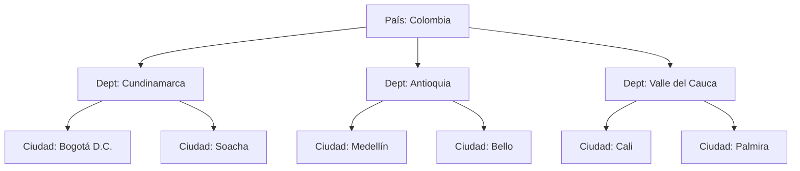

# 📊 Módulo de Catálogos - Documentación Técnica

## 📋 Descripción General

El módulo de catálogos es el **sistema de datos maestros** del OOTS Colombia, proporcionando todas las listas de valores predefinidos que se utilizan a lo largo de la aplicación. Este módulo centraliza la gestión de datos de referencia como tipos de documento, géneros, situaciones identificadas, planes de seguimiento, y otros catálogos especializados que garantizan la estandarización y consistencia de la información.

## 🏗️ Arquitectura

```
catalogs/
├── catalogs.controller.ts       # Controlador principal de catálogos
├── catalogs.service.ts          # Servicio con lógica de catálogos
├── catalogs.module.ts           # Configuración del módulo
├── dto/
│   ├── create-catalog.dto.ts    # DTO para crear catálogos básicos
│   └── update-catalog.dto.ts    # DTO para actualizar catálogos
└── entities/
    ├── document-type.entity.ts  # Tipos de documento (CC, TI, CE, etc.)
    ├── gender.entity.ts         # Géneros (Masculino, Femenino, Otro)
    ├── identified-situation.entity.ts  # Situaciones identificadas
    ├── follow-up-plan.entity.ts # Planes de seguimiento
    ├── city.entity.ts           # Ciudades y municipios
    ├── department.entity.ts     # Departamentos de Colombia
    ├── country.entity.ts        # Países
    ├── marital-status.entity.ts # Estados civiles
    ├── educational-level.entity.ts    # Niveles educativos
    ├── occupation.entity.ts     # Ocupaciones
    ├── ethnic-group.entity.ts   # Grupos étnicos
    ├── disability-type.entity.ts     # Tipos de discapacidad
    └── insurance-regime.entity.ts     # Regímenes de aseguramiento
```

## 📊 Modelo de Datos

### Catálogos Básicos (Base Entity)

Todos los catálogos básicos comparten una estructura común:

```typescript
// Base para todos los catálogos simples
@Entity()
export abstract class BaseCatalog {
  @PrimaryGeneratedColumn()
  id: number;

  @Column({ length: 100, unique: true })
  name: string;

  @Column({ length: 255, nullable: true })
  description?: string;

  @Column({ default: true })
  isActive: boolean;

  @CreateDateColumn()
  createdAt: Date;

  @UpdateDateColumn()
  updatedAt: Date;
}
```

### 1. Tipos de Documento (DocumentType)

```typescript
@Entity('document_types')
export class DocumentType extends BaseCatalog {
  @Column({ length: 10, unique: true })
  code: string; // CC, TI, CE, PA, RC, etc.

  @Column({ length: 150 })
  fullName: string; // Nombre completo del documento

  @Column({ default: false })
  requiresExpiration: boolean; // Si requiere fecha de vencimiento

  @OneToMany(() => Participant, (participant) => participant.documentType)
  participants?: Participant[];
}
```

**Datos Predefinidos:**

```sql
INSERT INTO document_types (code, name, fullName, requiresExpiration, description) VALUES
('CC', 'Cédula de Ciudadanía', 'Cédula de Ciudadanía Colombiana', false, 'Documento de identidad para ciudadanos colombianos mayores de edad'),
('TI', 'Tarjeta de Identidad', 'Tarjeta de Identidad de Menores', false, 'Documento de identidad para menores de edad'),
('CE', 'Cédula de Extranjería', 'Cédula de Extranjería', true, 'Documento para extranjeros residentes en Colombia'),
('PA', 'Pasaporte', 'Pasaporte', true, 'Documento de viaje internacional'),
('RC', 'Registro Civil', 'Registro Civil de Nacimiento', false, 'Documento de identidad para menores de 7 años'),
('AS', 'Adulto sin ID', 'Adulto sin Identificación', false, 'Para casos especiales sin documento'),
('MS', 'Menor sin ID', 'Menor sin Identificación', false, 'Para menores en casos especiales sin documento');
```

### 2. Géneros (Gender)

```typescript
@Entity('genders')
export class Gender extends BaseCatalog {
  @Column({ length: 5, unique: true })
  code: string; // M, F, O

  @OneToMany(() => Participant, (participant) => participant.gender)
  participants?: Participant[];
}
```

**Datos Predefinidos:**

```sql
INSERT INTO genders (code, name, description) VALUES
('M', 'Masculino', 'Género masculino'),
('F', 'Femenino', 'Género femenino'),
('O', 'Otro', 'Otro género o prefiere no especificar');
```

### 3. Situaciones Identificadas (IdentifiedSituation)

```typescript
@Entity('identified_situations')
export class IdentifiedSituation extends BaseCatalog {
  @Column({ length: 20, unique: true })
  code: string; // SIT001, SIT002, etc.

  @Column({ length: 100 })
  category: string; // FAMILIAR, LABORAL, PERSONAL, SALUD, etc.

  @Column({ type: 'int', default: 0 })
  priority: number; // 1=Alta, 2=Media, 3=Baja

  @Column({ type: 'text', nullable: true })
  interventionGuidelines?: string; // Guías de intervención

  // Campo JSON para almacenar referencias de casos
  @Column({ type: 'json', nullable: true })
  caseReferences?: number[]; // Array de case IDs que usan esta situación
}
```

**Datos Predefinidos:**

```sql
INSERT INTO identified_situations (code, name, category, priority, description, interventionGuidelines) VALUES
('SIT001', 'Estrés', 'PERSONAL', 2, 'Situaciones de estrés y presión emocional', 'Técnicas de relajación, manejo del tiempo, identificación de factores estresantes'),
('SIT002', 'Problemas familiares', 'FAMILIAR', 1, 'Conflictos y dificultades en el entorno familiar', 'Terapia familiar, comunicación asertiva, establecimiento de límites'),
('SIT003', 'Ansiedad', 'SALUD', 1, 'Trastornos de ansiedad y síntomas relacionados', 'Terapia cognitivo-conductual, técnicas de respiración, mindfulness'),
('SIT004', 'Depresión', 'SALUD', 1, 'Episodios depresivos y estados de ánimo bajo', 'Evaluación psiquiátrica, activación conductual, apoyo psicológico'),
('SIT005', 'Conflictos laborales', 'LABORAL', 2, 'Problemas en el ambiente de trabajo', 'Mediación laboral, habilidades de comunicación, gestión de conflictos'),
('SIT006', 'Problemas económicos', 'PERSONAL', 2, 'Dificultades financieras y económicas', 'Orientación financiera, búsqueda de recursos, planificación presupuestaria'),
('SIT007', 'Violencia doméstica', 'FAMILIAR', 1, 'Situaciones de violencia en el hogar', 'Protocolo de seguridad, apoyo psicológico, referencias legales'),
('SIT008', 'Problemas de pareja', 'FAMILIAR', 2, 'Conflictos y dificultades en relaciones de pareja', 'Terapia de pareja, comunicación, resolución de conflictos'),
('SIT009', 'Adicciones', 'SALUD', 1, 'Dependencia a sustancias o comportamientos', 'Referencia especializada, grupos de apoyo, tratamiento integral'),
('SIT010', 'Problemas académicos', 'PERSONAL', 2, 'Dificultades en el rendimiento educativo', 'Apoyo pedagógico, técnicas de estudio, manejo de ansiedad académica');
```

### 4. Planes de Seguimiento (FollowUpPlan)

```typescript
@Entity('follow_up_plans')
export class FollowUpPlan extends BaseCatalog {
  @Column({ length: 20, unique: true })
  code: string; // FUP001, FUP002, etc.

  @Column({ type: 'int' })
  estimatedDurationWeeks: number; // Duración estimada en semanas

  @Column({ type: 'int' })
  sessionFrequency: number; // Frecuencia de sesiones por semana

  @Column({ length: 100 })
  targetGroup: string; // INDIVIDUAL, GRUPAL, FAMILIAR

  @Column({ type: 'text', nullable: true })
  objectives?: string; // Objetivos del plan

  @Column({ type: 'text', nullable: true })
  activities?: string; // Actividades típicas

  @Column({ type: 'json', nullable: true })
  requiredResources?: string[]; // Recursos necesarios

  // Campo JSON para almacenar referencias de casos
  @Column({ type: 'json', nullable: true })
  caseReferences?: number[]; // Array de case IDs que usan este plan
}
```

**Datos Predefinidos:**

```sql
INSERT INTO follow_up_plans (code, name, estimatedDurationWeeks, sessionFrequency, targetGroup, description, objectives, activities) VALUES
('FUP001', 'Orientación Psicológica Individual', 8, 1, 'INDIVIDUAL', 'Plan de orientación psicológica personalizada', 'Desarrollo de estrategias de afrontamiento, mejora del bienestar emocional', 'Sesiones individuales de 50 minutos, técnicas terapéuticas específicas'),
('FUP002', 'Terapia Familiar', 12, 1, 'FAMILIAR', 'Intervención terapéutica con enfoque familiar', 'Mejora de la comunicación familiar, resolución de conflictos', 'Sesiones familiares, dinámicas grupales, tareas para casa'),
('FUP003', 'Grupo de Apoyo', 6, 2, 'GRUPAL', 'Participación en grupos de apoyo mutuo', 'Desarrollo de habilidades sociales, apoyo entre pares', 'Reuniones grupales, actividades de integración, intercambio de experiencias'),
('FUP004', 'Seguimiento Médico', 16, 1, 'INDIVIDUAL', 'Seguimiento médico especializado', 'Control de condiciones médicas, adherencia al tratamiento', 'Consultas médicas, exámenes de control, ajuste de medicación'),
('FUP005', 'Terapia de Pareja', 10, 1, 'PAREJA', 'Intervención terapéutica para parejas', 'Mejora de la relación, comunicación efectiva', 'Sesiones de pareja, ejercicios de comunicación, resolución de conflictos');
```

### 5. Ubicación Geográfica

#### País (Country)

```typescript
@Entity('countries')
export class Country extends BaseCatalog {
  @Column({ length: 3, unique: true })
  isoCode: string; // COL, USA, ESP, etc.

  @OneToMany(() => Department, (department) => department.country)
  departments?: Department[];
}
```

#### Departamento (Department)

```typescript
@Entity('departments')
export class Department extends BaseCatalog {
  @Column({ length: 10, unique: true })
  code: string; // 11, 05, 08, etc.

  @ManyToOne(() => Country, (country) => country.departments)
  @JoinColumn({ name: 'country_id' })
  country: Country;

  @Column({ name: 'country_id' })
  countryId: number;

  @OneToMany(() => City, (city) => city.department)
  cities?: City[];
}
```

#### Ciudad (City)

```typescript
@Entity('cities')
export class City extends BaseCatalog {
  @Column({ length: 10, unique: true })
  code: string; // 11001, 05001, etc.

  @ManyToOne(() => Department, (department) => department.cities)
  @JoinColumn({ name: 'department_id' })
  department: Department;

  @Column({ name: 'department_id' })
  departmentId: number;

  @OneToMany(() => Participant, (participant) => participant.city)
  participants?: Participant[];
}
```

### 6. Catálogos Demográficos

#### Estado Civil (MaritalStatus)

```typescript
@Entity('marital_statuses')
export class MaritalStatus extends BaseCatalog {
  @Column({ length: 5, unique: true })
  code: string; // S, M, D, V, UL

  @OneToMany(() => Participant, (participant) => participant.maritalStatus)
  participants?: Participant[];
}
```

#### Nivel Educativo (EducationalLevel)

```typescript
@Entity('educational_levels')
export class EducationalLevel extends BaseCatalog {
  @Column({ length: 10, unique: true })
  code: string; // NIN, PRI, SEC, TEC, UNI, POS

  @Column({ type: 'int' })
  hierarchyLevel: number; // 1-7 para ordenamiento

  @OneToMany(() => Participant, (participant) => participant.educationalLevel)
  participants?: Participant[];
}
```

#### Ocupación (Occupation)

```typescript
@Entity('occupations')
export class Occupation extends BaseCatalog {
  @Column({ length: 10, unique: true })
  code: string; // CIUO codes

  @Column({ length: 100 })
  category: string; // PROFESIONAL, TÉCNICO, OPERATIVO, etc.

  @OneToMany(() => Participant, (participant) => participant.occupation)
  participants?: Participant[];
}
```

#### Grupo Étnico (EthnicGroup)

```typescript
@Entity('ethnic_groups')
export class EthnicGroup extends BaseCatalog {
  @Column({ length: 10, unique: true })
  code: string; // MES, AFR, IND, etc.

  @OneToMany(() => Participant, (participant) => participant.ethnicGroup)
  participants?: Participant[];
}
```

#### Tipo de Discapacidad (DisabilityType)

```typescript
@Entity('disability_types')
export class DisabilityType extends BaseCatalog {
  @Column({ length: 10, unique: true })
  code: string; // FIS, INT, SEN, PSI

  @Column({ length: 100 })
  category: string; // FISICA, INTELECTUAL, SENSORIAL, PSICOSOCIAL

  @OneToMany(() => Participant, (participant) => participant.disabilityType)
  participants?: Participant[];
}
```

#### Régimen de Aseguramiento (InsuranceRegime)

```typescript
@Entity('insurance_regimes')
export class InsuranceRegime extends BaseCatalog {
  @Column({ length: 10, unique: true })
  code: string; // CON, SUB, ESP, NO

  @OneToMany(() => Participant, (participant) => participant.insuranceRegime)
  participants?: Participant[];
}
```

## 🎯 Funcionalidades del Módulo

### 1. Gestión de Catálogos Básicos

#### Operaciones CRUD Estándar

- **Crear**: Nuevos elementos de catálogo
- **Leer**: Consultar catálogos activos
- **Actualizar**: Modificar elementos existentes
- **Eliminar Lógico**: Desactivar en lugar de eliminar físicamente

#### Características Especiales

- **Activación/Desactivación**: Control de elementos activos
- **Código Único**: Códigos identificadores únicos
- **Ordenamiento**: Elementos ordenados alfabéticamente
- **Búsqueda**: Filtrado por nombre o código

### 2. Gestión de Relaciones Geográficas

#### Jerarquía País → Departamento → Ciudad



#### Consultas Jerárquicas

- Obtener departamentos por país
- Obtener ciudades por departamento
- Búsqueda de ciudades con información completa

### 3. Gestión de Referencias de Casos

#### Tracking de Uso

- Conteo de casos que usan cada elemento
- Referencias bidireccionales para integridad
- Estadísticas de uso por catálogo

#### Validaciones de Integridad

- Prevenir eliminación de elementos en uso
- Alertas de elementos no utilizados
- Sugerencias de consolidación

## 🛠️ API Endpoints

### Catálogos Básicos

#### GET /api/v1/catalogs/document-types

**Obtener tipos de documento**

**Response (200):**

```json
[
  {
    "id": 1,
    "code": "CC",
    "name": "Cédula de Ciudadanía",
    "fullName": "Cédula de Ciudadanía Colombiana",
    "requiresExpiration": false,
    "description": "Documento de identidad para ciudadanos colombianos mayores de edad",
    "isActive": true
  },
  {
    "id": 2,
    "code": "TI",
    "name": "Tarjeta de Identidad",
    "fullName": "Tarjeta de Identidad de Menores",
    "requiresExpiration": false,
    "description": "Documento de identidad para menores de edad",
    "isActive": true
  }
]
```

#### GET /api/v1/catalogs/genders

**Obtener géneros**

**Response (200):**

```json
[
  {
    "id": 1,
    "code": "M",
    "name": "Masculino",
    "description": "Género masculino",
    "isActive": true
  },
  {
    "id": 2,
    "code": "F",
    "name": "Femenino",
    "description": "Género femenino",
    "isActive": true
  },
  {
    "id": 3,
    "code": "O",
    "name": "Otro",
    "description": "Otro género o prefiere no especificar",
    "isActive": true
  }
]
```

#### GET /api/v1/catalogs/identified-situations

**Obtener situaciones identificadas**

**Response (200):**

```json
[
  {
    "id": 1,
    "code": "SIT001",
    "name": "Estrés",
    "category": "PERSONAL",
    "priority": 2,
    "description": "Situaciones de estrés y presión emocional",
    "interventionGuidelines": "Técnicas de relajación, manejo del tiempo, identificación de factores estresantes",
    "isActive": true,
    "usageCount": 85
  },
  {
    "id": 2,
    "code": "SIT002",
    "name": "Problemas familiares",
    "category": "FAMILIAR",
    "priority": 1,
    "description": "Conflictos y dificultades en el entorno familiar",
    "interventionGuidelines": "Terapia familiar, comunicación asertiva, establecimiento de límites",
    "isActive": true,
    "usageCount": 62
  }
]
```

#### GET /api/v1/catalogs/follow-up-plans

**Obtener planes de seguimiento**

**Response (200):**

```json
[
  {
    "id": 1,
    "code": "FUP001",
    "name": "Orientación Psicológica Individual",
    "estimatedDurationWeeks": 8,
    "sessionFrequency": 1,
    "targetGroup": "INDIVIDUAL",
    "description": "Plan de orientación psicológica personalizada",
    "objectives": "Desarrollo de estrategias de afrontamiento, mejora del bienestar emocional",
    "activities": "Sesiones individuales de 50 minutos, técnicas terapéuticas específicas",
    "requiredResources": [
      "Consultorio privado",
      "Material psicoeducativo",
      "Escalas de evaluación"
    ],
    "isActive": true,
    "usageCount": 145
  }
]
```

### Ubicación Geográfica

#### GET /api/v1/catalogs/countries

**Obtener países**

**Response (200):**

```json
[
  {
    "id": 1,
    "isoCode": "COL",
    "name": "Colombia",
    "description": "República de Colombia",
    "isActive": true,
    "departmentCount": 32
  }
]
```

#### GET /api/v1/catalogs/departments

**Obtener departamentos**

**Query Parameters:**

- `countryId` (opcional): Filtrar por país

**Response (200):**

```json
[
  {
    "id": 1,
    "code": "11",
    "name": "Cundinamarca",
    "description": "Departamento de Cundinamarca",
    "country": {
      "id": 1,
      "name": "Colombia",
      "isoCode": "COL"
    },
    "isActive": true,
    "cityCount": 116
  },
  {
    "id": 2,
    "code": "05",
    "name": "Antioquia",
    "description": "Departamento de Antioquia",
    "country": {
      "id": 1,
      "name": "Colombia",
      "isoCode": "COL"
    },
    "isActive": true,
    "cityCount": 125
  }
]
```

#### GET /api/v1/catalogs/cities

**Obtener ciudades**

**Query Parameters:**

- `departmentId` (opcional): Filtrar por departamento
- `search` (opcional): Búsqueda por nombre

**Response (200):**

```json
[
  {
    "id": 1,
    "code": "11001",
    "name": "Bogotá D.C.",
    "description": "Distrito Capital de Bogotá",
    "department": {
      "id": 1,
      "name": "Cundinamarca",
      "code": "11",
      "country": {
        "id": 1,
        "name": "Colombia",
        "isoCode": "COL"
      }
    },
    "isActive": true,
    "participantCount": 1250
  }
]
```

### Catálogos Demográficos

#### GET /api/v1/catalogs/marital-statuses

**Estados civiles**

**Response (200):**

```json
[
  {
    "id": 1,
    "code": "S",
    "name": "Soltero(a)",
    "description": "Persona soltera",
    "isActive": true
  },
  {
    "id": 2,
    "code": "M",
    "name": "Casado(a)",
    "description": "Persona casada",
    "isActive": true
  },
  {
    "id": 3,
    "code": "UL",
    "name": "Unión Libre",
    "description": "Persona en unión libre",
    "isActive": true
  }
]
```

#### GET /api/v1/catalogs/educational-levels

**Niveles educativos**

**Response (200):**

```json
[
  {
    "id": 1,
    "code": "NIN",
    "name": "Ninguno",
    "hierarchyLevel": 1,
    "description": "Sin educación formal",
    "isActive": true
  },
  {
    "id": 2,
    "code": "PRI",
    "name": "Primaria",
    "hierarchyLevel": 2,
    "description": "Educación primaria básica",
    "isActive": true
  },
  {
    "id": 3,
    "code": "SEC",
    "name": "Secundaria",
    "hierarchyLevel": 3,
    "description": "Educación secundaria",
    "isActive": true
  }
]
```

### Operaciones de Administración

#### POST /api/v1/catalogs/identified-situations

**Crear nueva situación identificada**

**Request Body:**

```json
{
  "code": "SIT011",
  "name": "Duelo",
  "category": "PERSONAL",
  "priority": 1,
  "description": "Proceso de duelo por pérdida de seres queridos",
  "interventionGuidelines": "Terapia de duelo, apoyo emocional, proceso de aceptación"
}
```

**Response (201):**

```json
{
  "id": 11,
  "code": "SIT011",
  "name": "Duelo",
  "category": "PERSONAL",
  "priority": 1,
  "description": "Proceso de duelo por pérdida de seres queridos",
  "interventionGuidelines": "Terapia de duelo, apoyo emocional, proceso de aceptación",
  "isActive": true,
  "caseReferences": [],
  "createdAt": "2024-01-15T10:30:00.000Z",
  "updatedAt": "2024-01-15T10:30:00.000Z"
}
```

#### PATCH /api/v1/catalogs/identified-situations/:id

**Actualizar situación identificada**

**Request Body:**

```json
{
  "interventionGuidelines": "Terapia de duelo especializada, apoyo emocional grupal, proceso de aceptación con técnicas cognitivo-conductuales"
}
```

**Response (200):**

```json
{
  "id": 11,
  "code": "SIT011",
  "name": "Duelo",
  "category": "PERSONAL",
  "priority": 1,
  "description": "Proceso de duelo por pérdida de seres queridos",
  "interventionGuidelines": "Terapia de duelo especializada, apoyo emocional grupal, proceso de aceptación con técnicas cognitivo-conductuales",
  "isActive": true,
  "updatedAt": "2024-01-15T14:25:00.000Z"
}
```

#### DELETE /api/v1/catalogs/identified-situations/:id

**Desactivar situación identificada**

**Response (200):**

```json
{
  "message": "Identified situation deactivated successfully",
  "id": 11,
  "isActive": false
}
```

### Estadísticas y Reportes

#### GET /api/v1/catalogs/statistics

**Estadísticas generales de catálogos**

**Response (200):**

```json
{
  "totalCatalogs": 13,
  "catalogStatistics": [
    {
      "catalogName": "DocumentType",
      "totalItems": 7,
      "activeItems": 7,
      "usageCount": 1530
    },
    {
      "catalogName": "Gender",
      "totalItems": 3,
      "activeItems": 3,
      "usageCount": 1530
    },
    {
      "catalogName": "IdentifiedSituation",
      "totalItems": 10,
      "activeItems": 10,
      "usageCount": 850
    },
    {
      "catalogName": "FollowUpPlan",
      "totalItems": 5,
      "activeItems": 5,
      "usageCount": 425
    },
    {
      "catalogName": "City",
      "totalItems": 1122,
      "activeItems": 1122,
      "usageCount": 1530
    }
  ],
  "mostUsedItems": [
    {
      "catalog": "IdentifiedSituation",
      "item": "Estrés",
      "usageCount": 85
    },
    {
      "catalog": "IdentifiedSituation",
      "item": "Problemas familiares",
      "usageCount": 62
    },
    {
      "catalog": "FollowUpPlan",
      "item": "Orientación Psicológica Individual",
      "usageCount": 145
    }
  ],
  "leastUsedItems": [
    {
      "catalog": "IdentifiedSituation",
      "item": "Adicciones",
      "usageCount": 8
    },
    {
      "catalog": "FollowUpPlan",
      "item": "Grupo de Apoyo",
      "usageCount": 15
    }
  ]
}
```

#### GET /api/v1/catalogs/identified-situations/usage-report

**Reporte de uso de situaciones identificadas**

**Response (200):**

```json
{
  "reportDate": "2024-01-15T16:30:00.000Z",
  "totalSituations": 10,
  "totalUsages": 850,
  "usageByCategory": [
    {
      "category": "PERSONAL",
      "count": 320,
      "percentage": 37.6
    },
    {
      "category": "FAMILIAR",
      "count": 285,
      "percentage": 33.5
    },
    {
      "category": "SALUD",
      "count": 180,
      "percentage": 21.2
    },
    {
      "category": "LABORAL",
      "count": 65,
      "percentage": 7.6
    }
  ],
  "usageByPriority": [
    {
      "priority": 1,
      "priorityName": "Alta",
      "count": 420,
      "percentage": 49.4
    },
    {
      "priority": 2,
      "priorityName": "Media",
      "count": 350,
      "percentage": 41.2
    },
    {
      "priority": 3,
      "priorityName": "Baja",
      "count": 80,
      "percentage": 9.4
    }
  ],
  "detailedUsage": [
    {
      "id": 1,
      "code": "SIT001",
      "name": "Estrés",
      "category": "PERSONAL",
      "priority": 2,
      "usageCount": 85,
      "lastUsed": "2024-01-14T18:45:00.000Z"
    },
    {
      "id": 2,
      "code": "SIT002",
      "name": "Problemas familiares",
      "category": "FAMILIAR",
      "priority": 1,
      "usageCount": 62,
      "lastUsed": "2024-01-15T11:20:00.000Z"
    }
  ]
}
```

### Endpoints de Búsqueda

#### GET /api/v1/catalogs/search

**Búsqueda global en catálogos**

**Query Parameters:**

- `query` (requerido): Término de búsqueda
- `catalogs` (opcional): Array de catálogos específicos
- `limit` (opcional): Límite de resultados (default: 50)

**Response (200):**

```json
{
  "query": "Bogotá",
  "totalResults": 1,
  "results": [
    {
      "catalog": "City",
      "item": {
        "id": 1,
        "code": "11001",
        "name": "Bogotá D.C.",
        "description": "Distrito Capital de Bogotá",
        "department": "Cundinamarca",
        "country": "Colombia"
      },
      "matchType": "name"
    }
  ],
  "suggestions": ["Bogotá", "Bosa", "Bello", "Barranquilla"]
}
```

## 🔍 Validaciones y Reglas de Negocio

### Validaciones de Entrada

1. **Códigos Únicos:**
   - Todos los códigos deben ser únicos por catálogo
   - Formato específico según tipo de catálogo
   - No permitir caracteres especiales

2. **Nombres Únicos:**
   - Nombres únicos dentro de cada catálogo
   - Validación case-insensitive
   - Trimming automático de espacios

3. **Jerarquías Geográficas:**
   - Departamentos deben pertenecer a un país válido
   - Ciudades deben pertenecer a un departamento válido
   - No permitir referencias circulares

### Reglas de Negocio

1. **Activación/Desactivación:**
   - No eliminar físicamente elementos con referencias
   - Marcar como inactivo en lugar de eliminar
   - Validar que elementos inactivos no se usen en nuevos registros

2. **Referencias de Integridad:**
   - Validar existencia antes de usar en participantes/casos
   - Contar referencias automáticamente
   - Alertar sobre elementos no utilizados

3. **Datos Maestros Inmutables:**
   - Algunos catálogos (documentos, géneros) son de solo lectura
   - Modificaciones requieren permisos administrativos
   - Auditoría completa de cambios

### Manejo de Errores

```json
// Código duplicado (409)
{
  "message": "Catalog item with code 'SIT001' already exists",
  "error": "Conflict",
  "statusCode": 409
}

// Elemento en uso (400)
{
  "message": "Cannot deactivate catalog item. It is referenced by 15 active cases",
  "error": "Bad Request",
  "statusCode": 400
}

// Jerarquía inválida (400)
{
  "message": "Department ID 99 does not belong to the specified country",
  "error": "Bad Request",
  "statusCode": 400
}

// Elemento no encontrado (404)
{
  "message": "Catalog item with ID 999 not found",
  "error": "Not Found",
  "statusCode": 404
}
```

## 🧪 Testing

### Pruebas Unitarias

```typescript
describe('CatalogsService', () => {
  describe('DocumentTypes', () => {
    it('should return all active document types', async () => {
      const result = await service.findAllDocumentTypes();

      expect(result).toBeDefined();
      expect(result.length).toBeGreaterThan(0);
      expect(result.every((dt) => dt.isActive)).toBe(true);
    });

    it('should validate unique codes', async () => {
      const createDto = {
        code: 'CC',
        name: 'Duplicate Code',
        fullName: 'Duplicate Code Test',
      };

      await expect(service.createDocumentType(createDto)).rejects.toThrow(
        "Catalog item with code 'CC' already exists",
      );
    });
  });

  describe('Geographic Hierarchy', () => {
    it('should return cities by department', async () => {
      const departmentId = 1; // Cundinamarca
      const cities = await service.findCitiesByDepartment(departmentId);

      expect(cities).toBeDefined();
      expect(cities.every((city) => city.departmentId === departmentId)).toBe(
        true,
      );
    });

    it('should validate department belongs to country', async () => {
      const invalidDto = {
        name: 'Test City',
        code: '99999',
        departmentId: 999,
      };

      await expect(service.createCity(invalidDto)).rejects.toThrow(
        'Department ID 999 does not belong to the specified country',
      );
    });
  });

  describe('Usage Tracking', () => {
    it('should track catalog item usage', async () => {
      const situationId = 1;
      const caseId = 100;

      await service.addCaseReference(
        'identified-situations',
        situationId,
        caseId,
      );

      const situation = await service.findIdentifiedSituation(situationId);
      expect(situation.caseReferences).toContain(caseId);
    });

    it('should prevent deactivation of items in use', async () => {
      const situationId = 1; // Estrés (en uso)

      await expect(
        service.deactivateIdentifiedSituation(situationId),
      ).rejects.toThrow('Cannot deactivate catalog item. It is referenced by');
    });
  });
});
```

### Pruebas de Integración

```typescript
describe('CatalogsController (e2e)', () => {
  it('/catalogs/document-types (GET)', () => {
    return request(app.getHttpServer())
      .get('/catalogs/document-types')
      .set('Authorization', `Bearer ${token}`)
      .expect(200)
      .expect((res) => {
        expect(res.body).toBeInstanceOf(Array);
        expect(res.body.length).toBeGreaterThan(0);
        expect(res.body[0]).toHaveProperty('code');
        expect(res.body[0]).toHaveProperty('name');
      });
  });

  it('/catalogs/identified-situations (POST)', () => {
    const createDto = {
      code: 'TEST001',
      name: 'Test Situation',
      category: 'TEST',
      priority: 2,
      description: 'Test situation for e2e testing',
    };

    return request(app.getHttpServer())
      .post('/catalogs/identified-situations')
      .set('Authorization', `Bearer ${token}`)
      .send(createDto)
      .expect(201)
      .expect((res) => {
        expect(res.body.code).toBe(createDto.code);
        expect(res.body.name).toBe(createDto.name);
        expect(res.body.isActive).toBe(true);
      });
  });

  it('/catalogs/cities?departmentId=1 (GET)', () => {
    return request(app.getHttpServer())
      .get('/catalogs/cities?departmentId=1')
      .set('Authorization', `Bearer ${token}`)
      .expect(200)
      .expect((res) => {
        expect(res.body).toBeInstanceOf(Array);
        if (res.body.length > 0) {
          expect(res.body[0].department).toBeDefined();
          expect(res.body[0].department.id).toBe(1);
        }
      });
  });
});
```

## 📊 Performance y Optimización

### Índices de Base de Datos

```sql
-- Índices para búsquedas frecuentes
CREATE INDEX idx_document_types_code ON document_types(code);
CREATE INDEX idx_genders_code ON genders(code);
CREATE INDEX idx_identified_situations_code ON identified_situations(code);
CREATE INDEX idx_identified_situations_category ON identified_situations(category);
CREATE INDEX idx_follow_up_plans_code ON follow_up_plans(code);

-- Índices para jerarquía geográfica
CREATE INDEX idx_departments_country_id ON departments(country_id);
CREATE INDEX idx_cities_department_id ON cities(department_id);
CREATE INDEX idx_cities_name ON cities(name);

-- Índices compuestos para consultas complejas
CREATE INDEX idx_catalogs_active_name ON document_types(is_active, name);
CREATE INDEX idx_situations_category_priority ON identified_situations(category, priority);
```

### Caché de Catálogos

```typescript
@Injectable()
export class CatalogsService {
  private readonly cacheManager = new Map<string, any>();
  private readonly CACHE_TTL = 3600000; // 1 hora

  async findAllDocumentTypes(): Promise<DocumentType[]> {
    const cacheKey = 'document-types-active';

    if (this.cacheManager.has(cacheKey)) {
      const cached = this.cacheManager.get(cacheKey);
      if (Date.now() - cached.timestamp < this.CACHE_TTL) {
        return cached.data;
      }
    }

    const data = await this.documentTypeRepository.find({
      where: { isActive: true },
      order: { name: 'ASC' },
    });

    this.cacheManager.set(cacheKey, {
      data,
      timestamp: Date.now(),
    });

    return data;
  }

  invalidateCache(pattern: string): void {
    for (const key of this.cacheManager.keys()) {
      if (key.includes(pattern)) {
        this.cacheManager.delete(key);
      }
    }
  }
}
```

### Paginación Eficiente

```typescript
async findCitiesWithPagination(
  departmentId?: number,
  search?: string,
  page: number = 1,
  limit: number = 50
): Promise<PaginatedResult<City>> {
  const queryBuilder = this.cityRepository
    .createQueryBuilder('city')
    .leftJoinAndSelect('city.department', 'department')
    .leftJoinAndSelect('department.country', 'country')
    .where('city.isActive = :isActive', { isActive: true });

  if (departmentId) {
    queryBuilder.andWhere('city.departmentId = :departmentId', { departmentId });
  }

  if (search) {
    queryBuilder.andWhere('city.name ILIKE :search', { search: `%${search}%` });
  }

  const [data, total] = await queryBuilder
    .orderBy('city.name', 'ASC')
    .skip((page - 1) * limit)
    .take(limit)
    .getManyAndCount();

  return {
    data,
    total,
    page,
    limit,
    totalPages: Math.ceil(total / limit)
  };
}
```

## 📋 Reportes y Estadísticas

### Dashboard de Catálogos

```json
{
  "overview": {
    "totalCatalogs": 13,
    "totalItems": 3247,
    "activeItems": 3195,
    "inactiveItems": 52,
    "lastUpdate": "2024-01-15T16:30:00.000Z"
  },
  "catalogHealth": [
    {
      "catalogName": "DocumentType",
      "status": "HEALTHY",
      "totalItems": 7,
      "activeItems": 7,
      "usageRate": 100.0,
      "lastUsed": "2024-01-15T15:20:00.000Z"
    },
    {
      "catalogName": "IdentifiedSituation",
      "status": "OPTIMAL",
      "totalItems": 10,
      "activeItems": 10,
      "usageRate": 95.0,
      "lastUsed": "2024-01-15T16:10:00.000Z"
    },
    {
      "catalogName": "DisabilityType",
      "status": "UNDERUSED",
      "totalItems": 8,
      "activeItems": 8,
      "usageRate": 12.5,
      "lastUsed": "2024-01-10T09:15:00.000Z"
    }
  ],
  "geographicDistribution": {
    "countries": 1,
    "departments": 32,
    "cities": 1122,
    "participantsByDepartment": [
      {
        "department": "Cundinamarca",
        "participantCount": 450,
        "percentage": 29.4
      },
      {
        "department": "Antioquia",
        "participantCount": 380,
        "percentage": 24.8
      }
    ]
  },
  "usageTrends": {
    "monthlyUsage": [
      {
        "month": "2024-01",
        "newReferences": 125,
        "totalReferences": 1850
      }
    ],
    "topUsedItems": [
      {
        "catalog": "IdentifiedSituation",
        "item": "Estrés",
        "count": 85
      }
    ]
  }
}
```

## 🔮 Futuras Mejoras

### Funcionalidades Planificadas

1. **Catálogos Dinámicos**: Creación de catálogos personalizados por usuario
2. **Versionado**: Control de versiones de cambios en catálogos
3. **Importación Masiva**: Carga de catálogos desde archivos Excel/CSV
4. **Sincronización Externa**: Integración con sistemas gubernamentales (DANE, RUES)
5. **Catálogos Jerárquicos**: Support para jerarquías complejas (CIE-10, CIIU)
6. **Multiidioma**: Soporte para múltiples idiomas en catálogos
7. **Workflow de Aprobación**: Flujo de aprobación para cambios en catálogos críticos

### Mejoras Técnicas

1. **GraphQL API**: API GraphQL para consultas complejas
2. **Elasticsearch**: Búsqueda avanzada y facetada
3. **Redis Cache**: Caché distribuido para alta disponibilidad
4. **Event Sourcing**: Historial completo de cambios
5. **CQRS Pattern**: Separación de comandos y consultas
6. **ML Suggestions**: Sugerencias inteligentes basadas en uso

---

_Documentación del Módulo de Catálogos - OOTS Colombia v1.0.0_
