# 🗄️ Base de Datos

## 📋 Descripción General

La base de datos del sistema OOTS Colombia utiliza MySQL 8.0 con TypeORM como ORM. Está diseñada para gestionar información de usuarios, catálogos de datos maestros y participantes del sistema de atención a víctimas de violencias.

## 🏗️ Configuración

### 🐳 Docker Configuration

```yaml
# docker-compose.yml
services:
  db:
    image: mysql:8.0
    container_name: oots_mysql
    environment:
      MYSQL_ROOT_PASSWORD: root_password
      MYSQL_DATABASE: oots_colombia
      MYSQL_USER: oots_user
      MYSQL_PASSWORD: oots_password
    ports:
      - '3307:3306'
    volumes:
      - mysql_data:/var/lib/mysql
      - ./mysql-init:/docker-entrypoint-initdb.d
```

### 🔧 Conexión TypeORM

```typescript
// Configuración de conexión
{
  type: 'mysql',
  host: process.env.DB_HOST || 'localhost',
  port: parseInt(process.env.DB_PORT) || 3307,
  username: process.env.DB_USERNAME || 'oots_user',
  password: process.env.DB_PASSWORD || 'oots_password',
  database: process.env.DB_NAME || 'oots_colombia',
  entities: ['dist/**/*.entity{.ts,.js}'],
  synchronize: process.env.NODE_ENV === 'development',
  logging: process.env.NODE_ENV === 'development'
}
```

---

## 📊 Esquema de Entidades

### 👤 Users (Usuarios)

Almacena información de los usuarios del sistema.

```sql
CREATE TABLE users (
  id INT PRIMARY KEY AUTO_INCREMENT,
  first_name VARCHAR(50) NOT NULL,
  second_name VARCHAR(50) NULL,
  first_last_name VARCHAR(50) NOT NULL,
  second_last_name VARCHAR(50) NULL,
  email VARCHAR(100) UNIQUE NOT NULL,
  password VARCHAR(255) NOT NULL,
  phone_number VARCHAR(20) NULL,
  position VARCHAR(100) NULL,
  organization VARCHAR(200) NULL,
  status ENUM('ACTIVE', 'DELETED') DEFAULT 'ACTIVE',
  created_at TIMESTAMP DEFAULT CURRENT_TIMESTAMP,
  updated_at TIMESTAMP DEFAULT CURRENT_TIMESTAMP ON UPDATE CURRENT_TIMESTAMP,

  INDEX idx_email (email),
  INDEX idx_status (status),
  INDEX idx_created_at (created_at)
);
```

#### 🔍 Campos Principales

| Campo              | Tipo           | Descripción           | Restricciones               |
| ------------------ | -------------- | --------------------- | --------------------------- |
| `id`               | `INT`          | Identificador único   | PRIMARY KEY, AUTO_INCREMENT |
| `first_name`       | `VARCHAR(50)`  | Primer nombre         | NOT NULL                    |
| `second_name`      | `VARCHAR(50)`  | Segundo nombre        | NULLABLE                    |
| `first_last_name`  | `VARCHAR(50)`  | Primer apellido       | NOT NULL                    |
| `second_last_name` | `VARCHAR(50)`  | Segundo apellido      | NULLABLE                    |
| `email`            | `VARCHAR(100)` | Correo electrónico    | UNIQUE, NOT NULL            |
| `password`         | `VARCHAR(255)` | Contraseña encriptada | NOT NULL                    |
| `phone_number`     | `VARCHAR(20)`  | Número telefónico     | NULLABLE                    |
| `position`         | `VARCHAR(100)` | Cargo profesional     | NULLABLE                    |
| `organization`     | `VARCHAR(200)` | Organización          | NULLABLE                    |
| `status`           | `ENUM`         | Estado del usuario    | ACTIVE/DELETED              |

---

## 🌍 Catálogos Geográficos

### 🌎 Countries (Países)

```sql
CREATE TABLE countries (
  id INT PRIMARY KEY AUTO_INCREMENT,
  code VARCHAR(2) UNIQUE NOT NULL,
  name VARCHAR(100) NOT NULL,
  iso3 VARCHAR(3) UNIQUE NOT NULL,
  phone_code VARCHAR(10) NOT NULL,

  INDEX idx_code (code),
  INDEX idx_iso3 (iso3)
);
```

### 🏛️ Departments (Departamentos)

```sql
CREATE TABLE departments (
  id INT PRIMARY KEY AUTO_INCREMENT,
  name VARCHAR(100) NOT NULL,
  code VARCHAR(10) NOT NULL,
  country_id INT NOT NULL,

  INDEX idx_country (country_id),
  INDEX idx_code (code),
  FOREIGN KEY (country_id) REFERENCES countries(id)
);
```

### 🏙️ Cities (Ciudades)

```sql
CREATE TABLE cities (
  id INT PRIMARY KEY AUTO_INCREMENT,
  name VARCHAR(100) NOT NULL,
  code VARCHAR(10) NOT NULL,
  department_id INT NOT NULL,

  INDEX idx_department (department_id),
  INDEX idx_code (code),
  FOREIGN KEY (department_id) REFERENCES departments(id)
);
```

---

## 📄 Catálogos de Identificación

### 🆔 Document Types (Tipos de Documento)

```sql
CREATE TABLE document_types (
  id INT PRIMARY KEY AUTO_INCREMENT,
  code VARCHAR(10) UNIQUE NOT NULL,
  name VARCHAR(100) NOT NULL,
  description TEXT NULL,
  is_active BOOLEAN DEFAULT TRUE,

  INDEX idx_code (code),
  INDEX idx_active (is_active)
);
```

#### 📋 Datos Iniciales

| ID  | Código | Nombre                | Descripción                           |
| --- | ------ | --------------------- | ------------------------------------- |
| 1   | CC     | Cédula de Ciudadanía  | Documento para ciudadanos colombianos |
| 2   | TI     | Tarjeta de Identidad  | Para menores entre 7-17 años          |
| 3   | RC     | Registro Civil        | Para menores de 7 años                |
| 4   | CE     | Cédula de Extranjería | Para extranjeros residentes           |
| 5   | PA     | Pasaporte             | Documento de viaje internacional      |

---

## 🚨 Catálogos de Violencias

### 🔴 Violence Types (Tipos de Violencia)

```sql
CREATE TABLE violence_types (
  id INT PRIMARY KEY AUTO_INCREMENT,
  name VARCHAR(100) NOT NULL,
  description TEXT NULL,
  category ENUM('INTERPERSONAL', 'COLECTIVA', 'ABANDONO') NOT NULL,
  is_active BOOLEAN DEFAULT TRUE,

  INDEX idx_category (category),
  INDEX idx_active (is_active)
);
```

#### 📋 Categorías de Violencia

| Categoría       | Descripción                      | Ejemplos                    |
| --------------- | -------------------------------- | --------------------------- |
| `INTERPERSONAL` | Violencia entre individuos       | Física, Psicológica, Sexual |
| `COLECTIVA`     | Violencia grupal o institucional | Armada, Institucional       |
| `ABANDONO`      | Negligencia y abandono           | Negligencia, Abandono       |

---

## 👥 Catálogos Demográficos

### ♂️♀️ Genders (Géneros)

```sql
CREATE TABLE genders (
  id INT PRIMARY KEY AUTO_INCREMENT,
  name VARCHAR(50) NOT NULL,
  code VARCHAR(2) UNIQUE NOT NULL,

  INDEX idx_code (code)
);
```

### 🌍 Ethnicities (Etnias)

```sql
CREATE TABLE ethnicities (
  id INT PRIMARY KEY AUTO_INCREMENT,
  name VARCHAR(100) NOT NULL,
  description TEXT NULL,
  is_indigenous BOOLEAN DEFAULT FALSE,

  INDEX idx_indigenous (is_indigenous)
);
```

### 🏳️‍🌈 Sexual Orientations (Orientaciones Sexuales)

```sql
CREATE TABLE sexual_orientations (
  id INT PRIMARY KEY AUTO_INCREMENT,
  name VARCHAR(100) NOT NULL,
  description TEXT NULL,

  INDEX idx_name (name)
);
```

### 🆔 Gender Identities (Identidades de Género)

```sql
CREATE TABLE gender_identities (
  id INT PRIMARY KEY AUTO_INCREMENT,
  name VARCHAR(100) NOT NULL,
  description TEXT NULL,

  INDEX idx_name (name)
);
```

---

## 💑 Catálogos Sociales

### 💒 Marital Statuses (Estados Civiles)

```sql
CREATE TABLE marital_statuses (
  id INT PRIMARY KEY AUTO_INCREMENT,
  name VARCHAR(50) NOT NULL,
  code VARCHAR(5) UNIQUE NOT NULL,

  INDEX idx_code (code)
);
```

#### 📋 Estados Disponibles

| ID  | Código | Nombre       |
| --- | ------ | ------------ |
| 1   | S      | Soltero/a    |
| 2   | C      | Casado/a     |
| 3   | UL     | Unión Libre  |
| 4   | D      | Divorciado/a |
| 5   | V      | Viudo/a      |
| 6   | SE     | Separado/a   |

---

## 🎓 Catálogos Educativos

### 📚 Education Levels (Niveles Educativos)

```sql
CREATE TABLE education_levels (
  id INT PRIMARY KEY AUTO_INCREMENT,
  name VARCHAR(100) NOT NULL,
  description TEXT NULL,
  level_order INT NOT NULL,

  INDEX idx_order (level_order)
);
```

#### 📊 Jerarquía Educativa

| Orden | Nivel             | Descripción           |
| ----- | ----------------- | --------------------- |
| 0     | Ninguno           | Sin estudios formales |
| 1     | Preescolar        | Educación inicial     |
| 2     | Básica Primaria   | 1° a 5° grado         |
| 3     | Básica Secundaria | 6° a 9° grado         |
| 4     | Media             | 10° y 11° grado       |
| 5     | Técnico           | Educación técnica     |
| 6     | Tecnológico       | Educación tecnológica |
| 7     | Profesional       | Universitaria         |
| 8     | Especialización   | Posgrado              |
| 9     | Maestría          | Posgrado avanzado     |
| 10    | Doctorado         | Máximo nivel          |

---

## 💰 Catálogos Socioeconómicos

### 🏠 Socioeconomic Strata (Estratos Socioeconómicos)

```sql
CREATE TABLE socioeconomic_strata (
  id INT PRIMARY KEY AUTO_INCREMENT,
  stratum INT UNIQUE NOT NULL,
  name VARCHAR(50) NOT NULL,
  description VARCHAR(100) NULL,
  subsidy_percentage DECIMAL(5,2) NOT NULL,

  INDEX idx_stratum (stratum)
);
```

#### 💹 Estructura de Estratos

| Estrato | Nombre    | Descripción | % Subsidio |
| ------- | --------- | ----------- | ---------- |
| 1       | Estrato 1 | Bajo-bajo   | +60%       |
| 2       | Estrato 2 | Bajo        | +40%       |
| 3       | Estrato 3 | Medio-bajo  | +15%       |
| 4       | Estrato 4 | Medio       | 0%         |
| 5       | Estrato 5 | Medio-alto  | -20%       |
| 6       | Estrato 6 | Alto        | -20%       |

---

## ♿ Catálogos de Discapacidad

### 🦽 Disability Types (Tipos de Discapacidad)

```sql
CREATE TABLE disability_types (
  id INT PRIMARY KEY AUTO_INCREMENT,
  name VARCHAR(100) NOT NULL,
  description TEXT NULL,
  category ENUM('SENSORIAL', 'FÍSICA', 'COGNITIVA', 'PSICOSOCIAL', 'MÚLTIPLE', 'NINGUNA') NOT NULL,

  INDEX idx_category (category)
);
```

---

## 👨‍👩‍👧‍👦 Catálogos Familiares

### 👪 Relationship Types (Tipos de Relación)

```sql
CREATE TABLE relationship_types (
  id INT PRIMARY KEY AUTO_INCREMENT,
  name VARCHAR(100) NOT NULL,
  description TEXT NULL,
  category ENUM('NUCLEAR', 'EXTENDIDA', 'POLÍTICA', 'NINGUNA') NOT NULL,

  INDEX idx_category (category)
);
```

#### 🏠 Estructura Familiar

| Categoría   | Descripción       | Ejemplos                        |
| ----------- | ----------------- | ------------------------------- |
| `NUCLEAR`   | Familia inmediata | Padre, Madre, Hijo/a, Hermano/a |
| `EXTENDIDA` | Familia extendida | Abuelos, Tíos, Primos           |
| `POLÍTICA`  | Familia política  | Cónyuge, Cuñados, Suegros       |
| `NINGUNA`   | Sin relación      | No hay vínculo familiar         |

---

## 🔐 Seguridad y Encriptación

### 🔒 Contraseñas

```typescript
// Configuración bcrypt
const saltRounds = 12;

// Hash automático antes de guardar
@BeforeInsert()
@BeforeUpdate()
async hashPassword() {
  if (this.password) {
    this.password = await bcrypt.hash(this.password, saltRounds);
  }
}
```

### 🛡️ Soft Delete

Las entidades críticas implementan soft delete:

```typescript
@DeleteDateColumn({ name: 'deleted_at' })
deletedAt?: Date;

@Column({
  type: 'enum',
  enum: UserStatus,
  default: UserStatus.ACTIVE
})
status: UserStatus;
```

---

## 📈 Índices y Rendimiento

### 🚀 Índices Principales

```sql
-- Usuarios
CREATE INDEX idx_users_email ON users(email);
CREATE INDEX idx_users_status ON users(status);
CREATE INDEX idx_users_created_at ON users(created_at);

-- Geografía
CREATE INDEX idx_departments_country ON departments(country_id);
CREATE INDEX idx_cities_department ON cities(department_id);

-- Catálogos
CREATE INDEX idx_document_types_code ON document_types(code);
CREATE INDEX idx_violence_types_category ON violence_types(category);
```

### 📊 Estrategias de Consulta

1. **Paginación**: Implementada en endpoints que retornan listas
2. **Filtrado**: Índices en campos de búsqueda frecuente
3. **Relaciones**: Lazy loading por defecto, eager cuando es necesario
4. **Cache**: Catálogos estáticos en memoria

---

## 🔄 Migraciones

### 📝 Estructura de Migraciones

```bash
# Generar migración
npm run migration:generate -- -n CreateUsersTable

# Ejecutar migraciones
npm run migration:run

# Revertir migración
npm run migration:revert
```

### 🗂️ Archivos de Inicialización

```sql
-- mysql-init/init.sql
-- Datos iniciales para catálogos
INSERT INTO countries (code, name, iso3, phone_code) VALUES
('CO', 'Colombia', 'COL', '+57'),
('VE', 'Venezuela', 'VEN', '+58'),
('EC', 'Ecuador', 'ECU', '+593');

INSERT INTO document_types (code, name, description) VALUES
('CC', 'Cédula de Ciudadanía', 'Documento de identidad para ciudadanos colombianos'),
('TI', 'Tarjeta de Identidad', 'Documento para menores entre 7-17 años'),
('RC', 'Registro Civil', 'Documento para menores de 7 años');
```

---

## 📊 Diagrama de Relaciones

```mermaid
erDiagram
    USERS {
        int id PK
        string first_name
        string email UK
        string password
        enum status
        datetime created_at
        datetime updated_at
    }

    COUNTRIES {
        int id PK
        string code UK
        string name
        string iso3 UK
        string phone_code
    }

    DEPARTMENTS {
        int id PK
        string name
        string code
        int country_id FK
    }

    CITIES {
        int id PK
        string name
        string code
        int department_id FK
    }

    DOCUMENT_TYPES {
        int id PK
        string code UK
        string name
        text description
        boolean is_active
    }

    VIOLENCE_TYPES {
        int id PK
        string name
        text description
        enum category
        boolean is_active
    }

    COUNTRIES ||--o{ DEPARTMENTS : contains
    DEPARTMENTS ||--o{ CITIES : contains
```



---

## 🛠️ Comandos Útiles

### 🐳 Docker

```bash
# Iniciar base de datos
docker-compose up -d db

# Ver logs de MySQL
docker-compose logs -f db

# Conectar a MySQL
docker exec -it oots_mysql mysql -u oots_user -p oots_colombia
```

### 🔧 TypeORM

```bash
# Sincronizar esquema (solo desarrollo)
npm run schema:sync

# Generar entidades desde DB
npm run schema:log

# Verificar conexión
npm run db:check
```

### 📊 Respaldos

```bash
# Crear respaldo
docker exec oots_mysql mysqldump -u oots_user -p oots_colombia > backup.sql

# Restaurar respaldo
docker exec -i oots_mysql mysql -u oots_user -p oots_colombia < backup.sql
```

---

## 🚨 Consideraciones de Producción

### 🔒 Seguridad

1. **Variables de entorno**: Nunca hardcodear credenciales
2. **SSL/TLS**: Conexiones encriptadas en producción
3. **Firewall**: Restringir acceso al puerto 3306
4. **Usuarios**: Principio de menor privilegio

### 📈 Rendimiento

1. **Índices**: Monitorear queries lentas
2. **Conexiones**: Pool de conexiones optimizado
3. **Cache**: Redis para catálogos frecuentes
4. **Particionado**: Para tablas con mucho volumen

### 🔄 Alta Disponibilidad

1. **Replicación**: Master-slave setup
2. **Respaldos**: Automatizados y probados
3. **Monitoreo**: Alertas de salud de DB
4. **Failover**: Procedimientos documentados

---

## 🔗 Enlaces Relacionados

- [Documentación de Usuarios](./users.md)
- [Documentación de Catálogos](./catalogs.md)
- [Guía de Configuración](../README.md#configuración)
- [Ejemplos de Consultas](./examples/database-queries.md)
