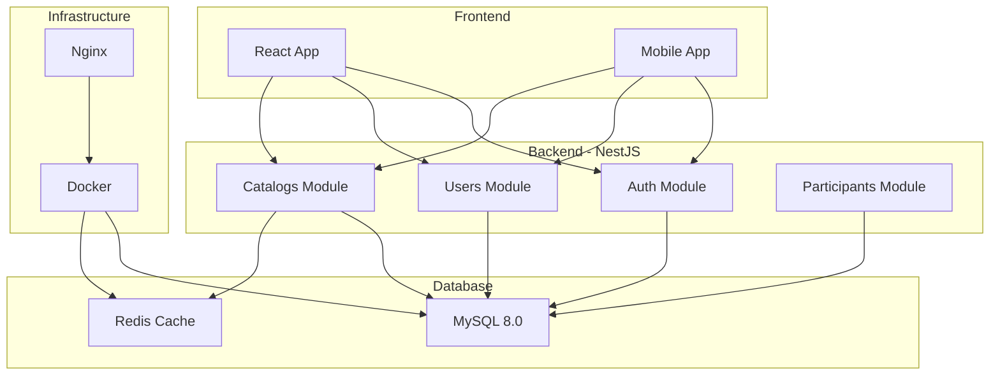

# 📖 Índice de Documentación - OOTS Colombia Backend

## 📋 Documentación Principal

### 🏠 [README Principal](../README.md)

Punto de entrada principal con información general del proyecto, instalación, y configuración inicial.

---

## 📚 Módulos del Sistema

### 🔐 [Autenticación](./authentication.md)

- **Descripción**: Sistema de registro, login y gestión de sesiones
- **Endpoints**: `/auth/register`, `/auth/login`, `/auth/profile`
- **Características**: JWT, bcrypt, validaciones
- **Uso**: Gestión de usuarios y seguridad

### 👥 [Usuarios](./users.md)

- **Descripción**: CRUD completo de usuarios del sistema
- **Endpoints**: `/users/*`
- **Características**: Soft delete, restauración, validaciones
- **Uso**: Gestión de profesionales y administradores

### 📚 [Catálogos](./catalogs.md)

- **Descripción**: Datos maestros y catálogos de referencia
- **Endpoints**: Múltiples endpoints de catálogos
- **Características**: Geografía, demografía, tipos de violencia
- **Uso**: Datos de referencia para formularios

### 🗄️ [Base de Datos](./database.md)

- **Descripción**: Esquema, configuración y gestión de BD
- **Tecnología**: MySQL 8.0, TypeORM
- **Características**: Migraciones, índices, seguridad
- **Uso**: Comprensión de la estructura de datos

---

## 🎯 Ejemplos Prácticos

### 🔐 [Ejemplos de Autenticación](./examples/auth-examples.md)

- **Contenido**:
  - Registro de usuarios con validaciones
  - Login y gestión de tokens JWT
  - Obtención de perfil autenticado
  - Manejo de errores de autenticación
- **Tecnologías**: cURL, JavaScript, React
- **Casos de uso**: Implementación de auth en frontend

### 👤 [Ejemplos de Usuarios](./examples/user-examples.md)

- **Contenido**:
  - CRUD completo de usuarios
  - Validaciones de frontend
  - Soft delete y restauración
  - Hooks de React para gestión
- **Tecnologías**: cURL, JavaScript, React
- **Casos de uso**: Gestión completa de usuarios

### 📊 [Ejemplos de Catálogos](./examples/catalog-examples.md)

- **Contenido**:
  - Consumo de todos los catálogos
  - Navegación geográfica (país → departamento → ciudad)
  - Selectores demográficos
  - Búsqueda y filtrado
- **Tecnologías**: JavaScript, React
- **Casos de uso**: Formularios dinámicos con catálogos

---

## 🚀 Guías de Inicio Rápido

### 🐳 Docker Setup

```bash
# Clonar repositorio
git clone <repository-url>
cd backend-oots

# Levantar servicios
docker-compose up -d

# Ver logs
docker-compose logs -f
```

### 🔧 Desarrollo Local

```bash
# Instalar dependencias
npm install

# Configurar variables de entorno
cp .env.example .env

# Ejecutar migraciones
npm run migration:run

# Iniciar desarrollo
npm run start:dev
```

### 🧪 Testing

```bash
# Tests unitarios
npm run test

# Tests e2e
npm run test:e2e

# Coverage
npm run test:cov
```

---

## 📋 Checklist de Implementación

### ✅ Backend Completado

- [x] **Autenticación JWT**: Registro, login, perfil
- [x] **Gestión de Usuarios**: CRUD con soft delete
- [x] **Catálogos**: 15+ endpoints de datos maestros
- [x] **Base de Datos**: Esquema completo con TypeORM
- [x] **Docker**: Configuración para desarrollo
- [x] **Documentación**: Guías completas y ejemplos

### 🔄 Módulos en Desarrollo

- [ ] **Participantes**: Sistema de gestión de víctimas
- [ ] **Reportes**: Generación de informes
- [ ] **Notificaciones**: Sistema de alertas
- [ ] **Archivos**: Gestión de documentos

### 🎯 Por Implementar

- [ ] **Tests**: Cobertura completa de tests
- [ ] **API Versioning**: Versionado de endpoints
- [ ] **Rate Limiting**: Limitación de peticiones
- [ ] **Logging**: Sistema de logs estructurados
- [ ] **Monitoring**: Métricas y monitoreo

---

## 🛠️ Herramientas y Tecnologías

### Backend Stack

| Tecnología          | Versión | Propósito              |
| ------------------- | ------- | ---------------------- |
| **NestJS**          | 11.0.1  | Framework principal    |
| **TypeORM**         | 0.3.27  | ORM para base de datos |
| **MySQL**           | 8.0     | Base de datos          |
| **Passport**        | -       | Autenticación          |
| **JWT**             | -       | Tokens de sesión       |
| **bcrypt**          | -       | Hash de contraseñas    |
| **class-validator** | -       | Validaciones           |

### Desarrollo

| Herramienta  | Propósito         |
| ------------ | ----------------- |
| **Docker**   | Contenedorización |
| **ESLint**   | Linting de código |
| **Prettier** | Formato de código |
| **Jest**     | Testing           |
| **Swagger**  | Documentación API |

---

## 📊 Arquitectura del Sistema



---

## 🔗 Enlaces Útiles

### Documentación Externa

- [NestJS Documentation](https://docs.nestjs.com/)
- [TypeORM Documentation](https://typeorm.io/)
- [MySQL 8.0 Reference](https://dev.mysql.com/doc/refman/8.0/en/)
- [JWT.io](https://jwt.io/)
- [Docker Documentation](https://docs.docker.com/)

### Estándares y Buenas Prácticas

- [REST API Design Guidelines](https://restfulapi.net/)
- [HTTP Status Codes](https://httpstatuses.com/)
- [Semantic Versioning](https://semver.org/)
- [Conventional Commits](https://www.conventionalcommits.org/)

### Herramientas de Testing

- [Postman Collection](./examples/postman-collection.json)
- [Insomnia Workspace](./examples/insomnia-workspace.json)
- [cURL Examples](./examples/)

---

## 📞 Soporte y Contacto

### 🐛 Reportar Issues

- **GitHub Issues**: Para bugs y mejoras
- **Documentación**: Para errores en documentación
- **Performance**: Para problemas de rendimiento

### 💬 Comunicación

- **Email**: [contacto@ootsproject.com]
- **Slack**: Workspace del equipo
- **Meetings**: Reuniones semanales de desarrollo

### 📚 Contribución

- **Pull Requests**: Seguir guías de contribución
- **Code Review**: Revisión obligatoria
- **Testing**: Tests requeridos para nuevas features

---

## 🏷️ Versionado

### Versión Actual: `1.0.0-beta`

#### Características Principales

- ✅ Sistema de autenticación completo
- ✅ Gestión de usuarios con CRUD
- ✅ Catálogos de datos maestros
- ✅ Base de datos estructurada
- ✅ Documentación completa

#### Próxima Versión: `1.1.0`

- 🔄 Módulo de participantes
- 🔄 Sistema de reportes básico
- 🔄 Mejoras en validaciones

#### Roadmap: `2.0.0`

- 🎯 API REST completamente funcional
- 🎯 Sistema de notificaciones
- 🎯 Dashboard administrativo
- 🎯 Integración con servicios externos

---

_Última actualización: Octubre 2024_
_Versión de documentación: 1.0.0_
